## Célja
A UI tesztelés célja, hogy a megírt felhasználói felületet ne kézzel kelljen tesztelnie a fejlesztőknek, hanem az automatizált teszteket lefuttatva gyorsan és hatékonyan lehessen teszteli az alkalmazásunk felhasználói felületét.

## UI tesztelési eszközök
A megadott feladatkiírásban feltüntetett 3 lehetőség (Selenium, Tosca, Appium) sajnos nem támogat Java Swing felhasználói felület tesztelést, viszont megpróbáltam AssertJ segtíségével letesztelni programunk felhasználói felületét. [AssertJ honlapja](http://joel-costigliola.github.io/assertj/assertj-swing.html)

## UI keretrendszer felállítása

Az AssertJ keretrendszert a pom.xml-be való függőség felvételével tudjuk elérni, majd pedig a JUnit tesztekhez hasonlóan írhatunk teszteket, amiben hivatkozhatjuk a felhasználói felület elemeit, rajtuk pedig műveleteket végezhetünk el(pl.: kattintás, érték beírása). Alapértelmezetten mindig egy olyan játékot indítottam, ahol két játékos játszott, egy szerelő és egy szabotőr.

Az AssertJ függőség a pom.xml-ben:

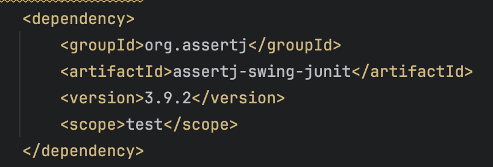

## Teszt 1
Elsőként a keretrendszer tesztjeként egy olyan tesztet írtam, amely szimplán létrehoz egy játékot 1-1 játékossal majd pedig az összes körön keresztül passzol, ez követően pedig bezárja a játékot. Ezzel a teszttel tudjuk megnézni, hogy az alap funkciók működnek-e a játék során.

## Teszt 2
A második tesztben a szabotőr játékos rálép egy csőre és kilyukasztja azt. Az ott folyó víz kifolyik a csőből, ezzel a szabotőrök pontszámát növelve. Ezt követően mindenki passzol amíg a játék véget nem ér, így tehát a szabtőrnek kell nyernie, ezt is tesztelem a játék végén, majd pedig kilépés következik.
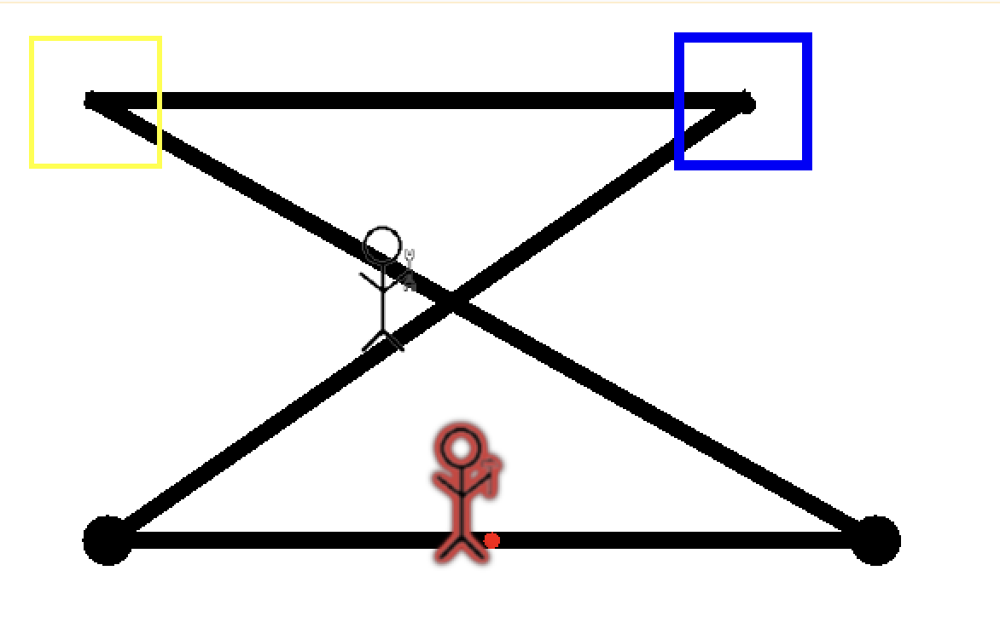

## Teszt 3
A teszt során szintén kilyukaszt a szabotőr egy csövet, viszont a szerelő ezt követően megjavítja azt. Ezt követően szintén mindenki passzol amíg a játék véget nem ér. Ebben a helyzetben a szerelőnek kell nyernie, ezt tesztelem a játék végén, majd pedig kilépek.
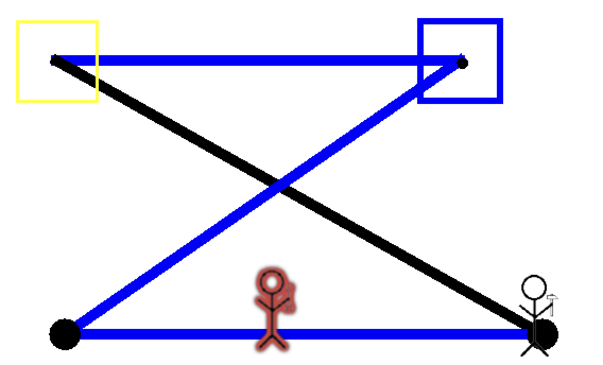

## Teszt 4
Ez a teszt nem játssza végig a játékot, csak a cső beragasztózásának működését teszteli. A szerelő játékos beragasztózza a csövet, amin éppen áll, ekkor pedig ellenőrzöm, hogy az a cső tényleg ragasztós lett-e.
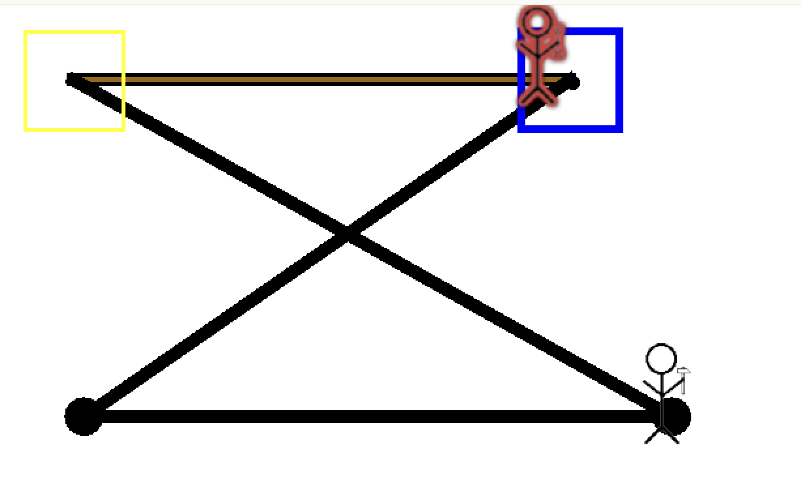

## Teszt 5
Az előző teszthez hasonlóan a cső síkossá tehetőségét teszteli. A nomád játékos rálép egy csőre, majd pedig síkossá teszi azt, ekkor pedig ellenőrzöm, hogy a cső tulajdonságai ennek megfelelően módosultak-e.
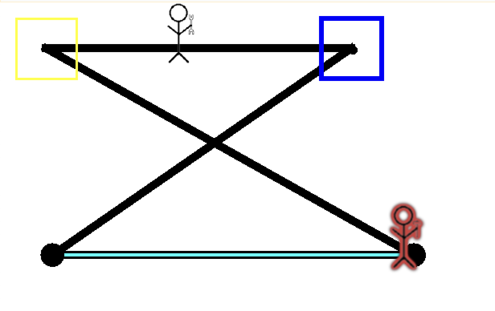

## Teszt 6

Ebben a tesztben azt ellenőrzöm, hogy működik-e egy új pumpa felvétele és annak lerakása. Elsőként a szerelő rálép a városra, felvesz egy pumpát, majd pedig továbbmegy egy csőre és ott leteszi. Ekkor ellenőrzöm, hogy a pumpa és a vele együtt létrejövő új cső hozzáadódik-e a játékhoz, és hogy ezek után a szerelő rá is tud-e lépni az új pumpára és csőre.

A teszt készítése során ennek köszönhetően találtam rá egy hibára a programban, hiszen eredetileg a pumpa lehelyezése után az csak a képernyőn jelent meg és a játékhoz sem az új cső sem pedig a pumpa nem adódott hozzá, ezért nem is volt látható a rajta átfolyó víz sem. Ezt a hibát javítottam és így már helyesen működik a program ezen része

Kép a javítás előtt:

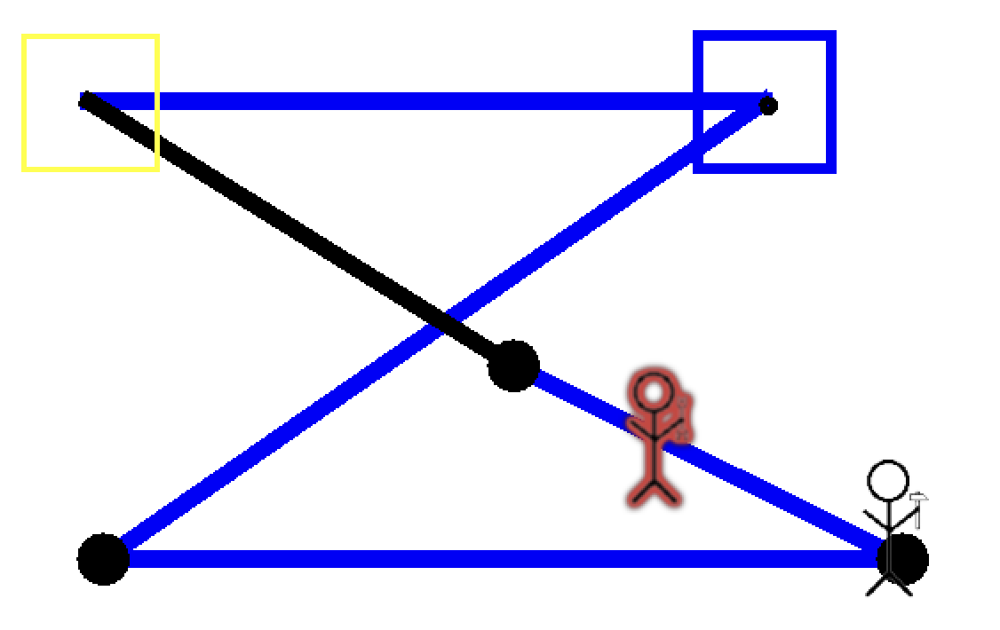

Kép a javítás után:
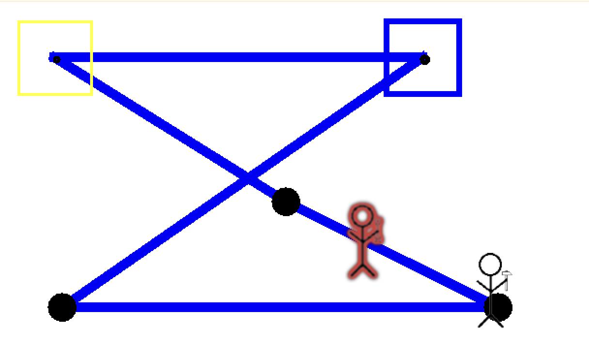

## Teszt 7

Ebben a tesztben azt ellenőrzöm, hogy működik-e egy új cső felvétele és annak bekötése egy új pumpába. Elsőként a szerelő rálép a városra, ott felvesz egy csövet. Majd pedig átmegy egy pumpára, és ott beköti. Ennek következtében az új csőnek is be kell kerülnie a játékba, víznek kell tudni folynia rajta keresztül. Ezek meglétét ellenőrzöm a teszt során.

Az előző esethez hasonlóan itt is találtam egy hibát a kódban, hiszen ebben az esetben sem történt meg az új cső hozzáadása a játékoz, így víz sem tudott rajta folyni.

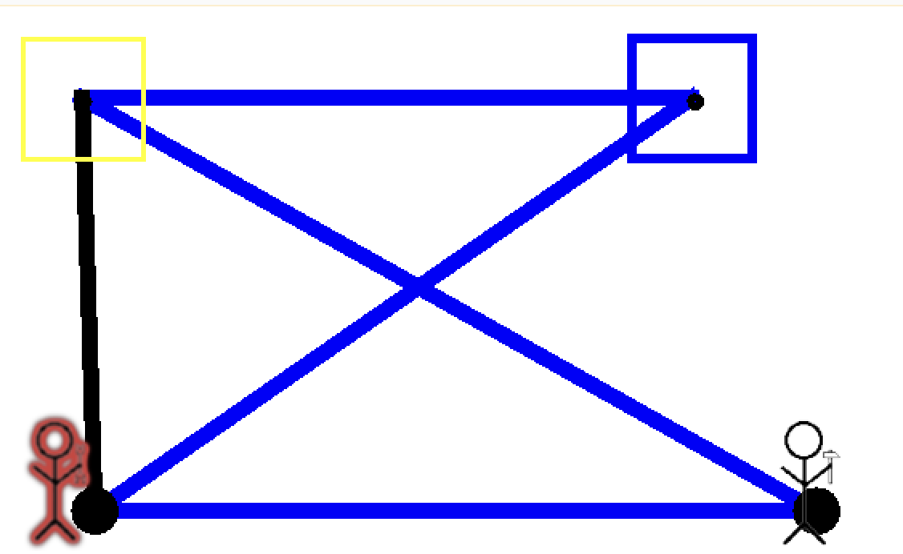

## Teszt 8 

Azt ellenőriztem le, hogy működik-e a pumpák átállítása. Ehhez ismételten le kellett helyeznem egy új csövet, mert a játék kezdő állásában minden pumpára két cső van rákötve, így nem állíthatóak át. Az új cső az előző tesztben lévő helyre került, majd pedig ezután a szerelő átállítja, hogy a pumpa kimenete az újonnan lehelyezett cső legyen. Ezt ellenőrzöm is a teszt során, hogy teljesült-e.

Ez a teszt is segített egy meglévő hiba megtalálásában és kijavításában, hiszen a kódban a "Change Pump" gomb eseménykezelője rossz if-else ágban volt, ezért bal egérgomb kattintásra le sem futott. A hibát javítva már helyesen műkdött a gomb és a funkciója is.

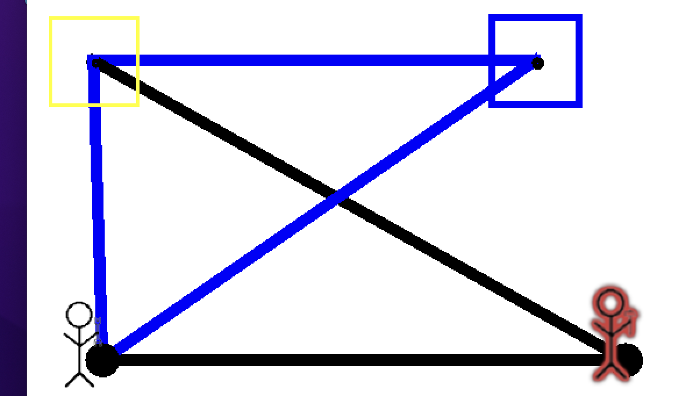

## Teszt 9
A tesztben az ellenőriztem le, hogy az új cső letétele után arra a csőre egy új pumpát is le tud-e helyezni a szerelő. Az új csővel a szerelő a bal alsó pumpát és a várost köti össze, majd errő a csőre teszi le a pumpát. Ezek után pedig ellenőriztem, hogy a megfelelő végpontok beállítódtak-e az új elemeknél.
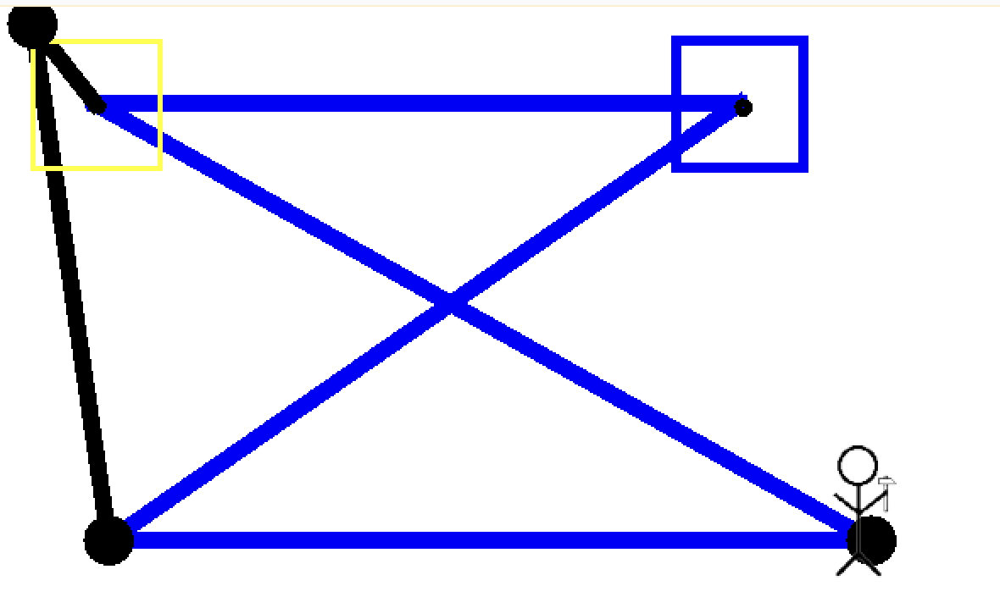

## Teszt 10
Ez egy összetett teszt, ami összesítve teszteli a pumpák és csövek felvételének és lerakásának működését, és egy pumpa átállításáat. A szerelő az előző teszthez hasonlóan felvesz egy csövet és egy pumpát is, majd pedig lehelyezi azokat az előző tesztnek megfelelően. Ezt követően pedig a bal alsó pumpát úgy állítja át, hogy a víz az új ágon folyjon. Ebben a konfigurációban a víznek ezen az úton is el kell tudnia jutni a városba, ezt ellenőrzöm a teszt során
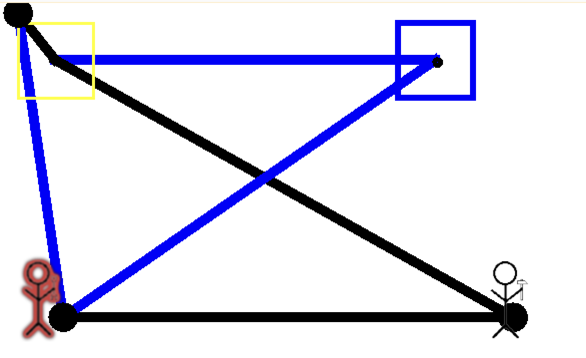
Az egyetlen hiba, amit felfedeztem a teszt során, hogy a víz folyásának megfelelően az automatikusan létrejövő csőnek is kék színűnek kellene lennie, ez viszont a képen láthatóan nem történik meg. A teszt ellenőrzi, hogy van-e benne víz tehát csak a felhasználói felületen nem jelenik meg az információ.